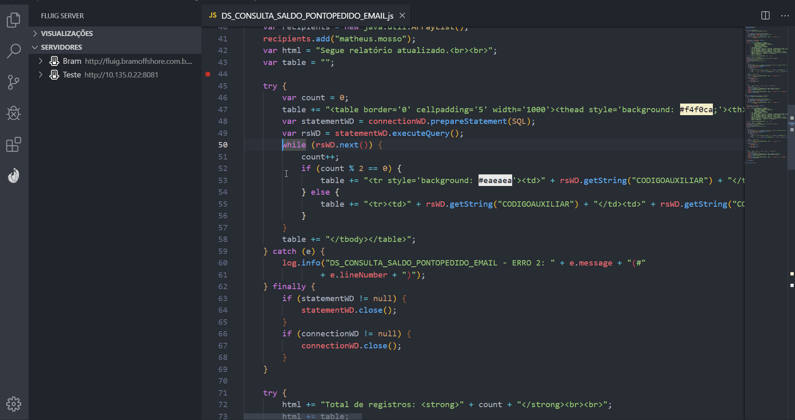
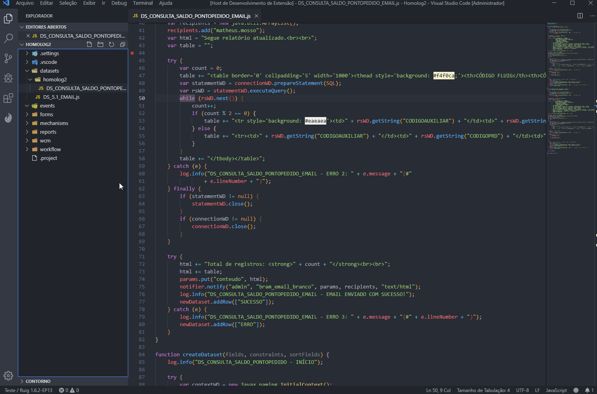
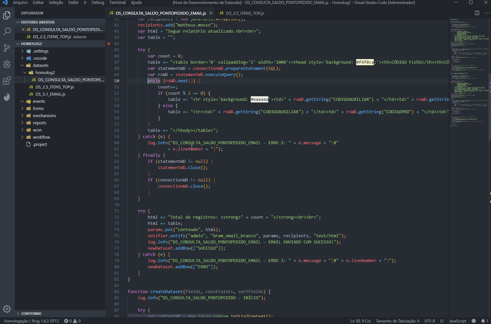

# VS Code Fluig [Em desenvolvimento]

Este é um projeto não oficial, desenvolvido para facilitar o uso do visual code com o Fluig.

## Funcionalidades
* [x] Salvar Servidor
* [x] Conectar ao Servidor
* [x] Exportar Novo Dataset
* [x] Exportar Dataset quando ja existir
* [x] Importar Dataset
* [ ] Exportar Formulário
* [ ] Importar Formulário
* [ ] Atalhos
* [ ] Snippets

## Configurar Servidores

* Clique no icone `"+"` no canto superior direito da visão, ao lado da aba `Servidores`.
* Preencha as informações de `Nome`, `Host`, `Porta`, `Empresa (código da empresa)`, `Usuario` e `Senha` do servidor.
* Clique no botão `Salvar`.

## Importar e Exportar Datasets

##### ! No momento é possivel apenas exportar um novo dataset.

* Selecione seu servidor `default`, que sera o servidor ativo para as importações/exportações
* Clique com o botão direito do mouse para mostrar as opções. (Para mostrar a opção de exportar clique em cima do arquivo que deseja exportar)

### Importar

* Selecione na lista de datasets qual dataset deseja importar

### Exportar

* Selecione o dataset que deseja exportar
* Digite o `nome` do dataset e em seguida sua `descrição`

# Contribuições

Este é um projeto de código aberto, sinta se a vontade para contribuir.

* **yarn version - 1.17.3**

Após clonar o projeto, execute o comando `yarn install` para baixar as dependências. 
Para rodar o projeto, abra o projeto no vs code e aperte `F5`, e irá rodar o projeto em modo desenvolver.